# Active Directory Home Lab – Deploy and Configure AD on VirtualBox

## Project Summary

This project demonstrates how to deploy and configure Active Directory (AD) in a virtualized on-premises environment using Oracle VirtualBox. A Windows Server 2019 Domain Controller was set up, organizational units and user accounts were created, and a Windows 11 client machine was joined to the domain and logged into using a domain user account.

This is a fully local lab — no cloud services were used — which demonstrates understanding of the underlying infrastructure behind AD.

---

## Environments and Technologies Used

- Oracle VirtualBox (VM host)
- Windows Server 2019 (Domain Controller)
- Windows 11 Enterprise (Client machine)
- Active Directory Domain Services (AD DS)
- DNS Server
- Active Directory Users and Computers (ADUC)

---

## Lab Objectives

1. Create and configure two VMs in VirtualBox on an isolated internal network
2. Install AD DS and DNS roles on the server
3. Promote the server to a Domain Controller and create a new forest
4. Configure static IP addresses on both machines
5. Create Organizational Units (OUs) and user accounts in Active Directory
6. Join the client machine to the domain
7. Verify domain login using a domain user account

---

## Step 1 – Set Up Virtual Machines in VirtualBox

Two VMs were created in Oracle VirtualBox and connected via an **Internal Network** named `AD-Lab-Network`, isolating them from the internet and allowing them to communicate with each other only.

- **DC-1** – Windows Server 2019 (Domain Controller)
- **Client-1** – Windows 11 Enterprise (Domain Client)

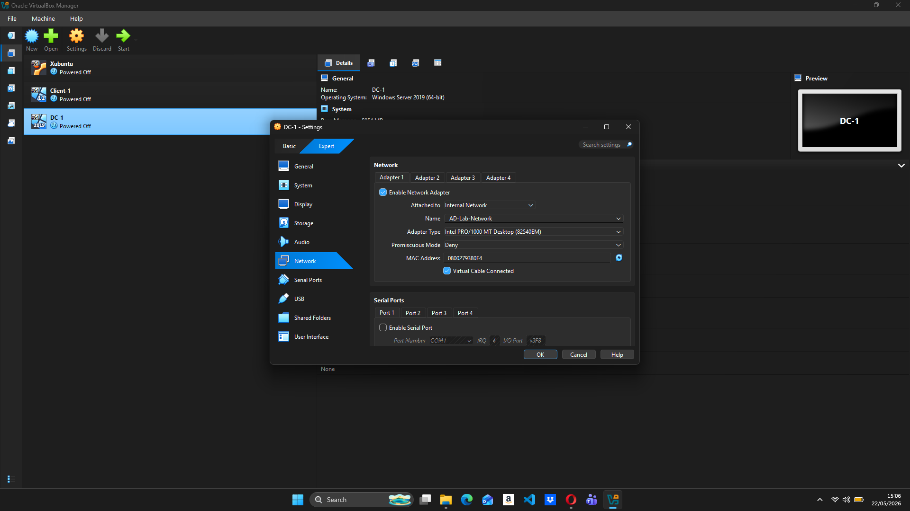
*DC-1 network adapter set to Internal Network: AD-Lab-Network*

---

## Step 2 – First Boot and Server Manager

DC-1 was powered on and booted into Windows Server 2019. Server Manager launched automatically with no roles installed yet.

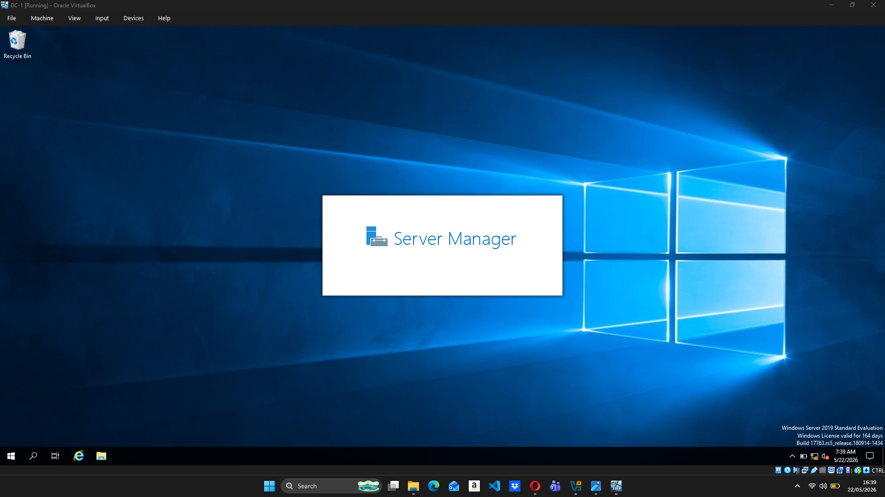
*Windows Server 2019 booting for the first time on DC-1*

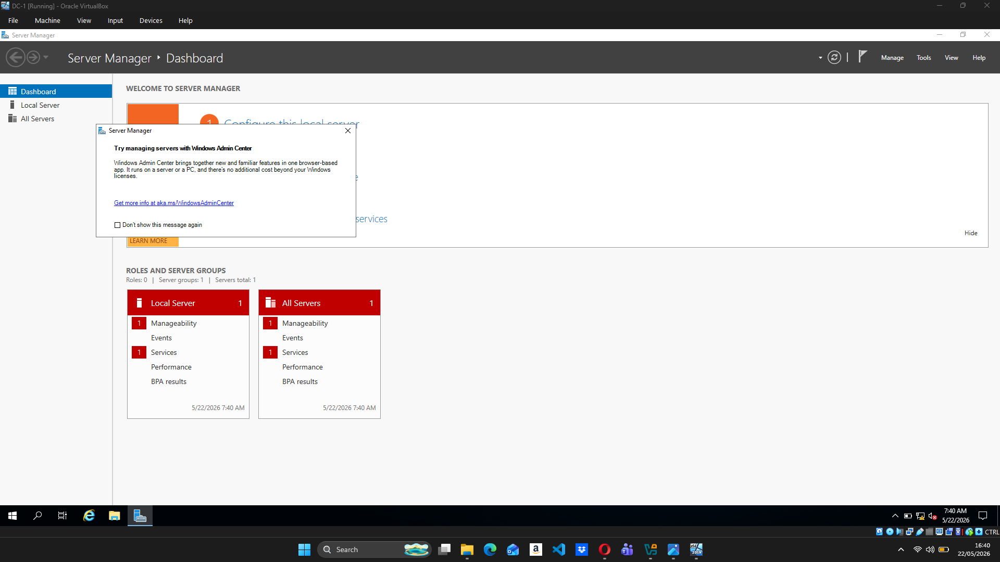
*Server Manager showing no roles installed (Roles: 0)*

---

## Step 3 – Install AD DS and DNS Roles

Using **Server Manager → Manage → Add Roles and Features**, the following roles were selected and installed:

- Active Directory Domain Services (AD DS)
- DNS Server
- Group Policy Management
- Remote Server Administration Tools (RSAT)

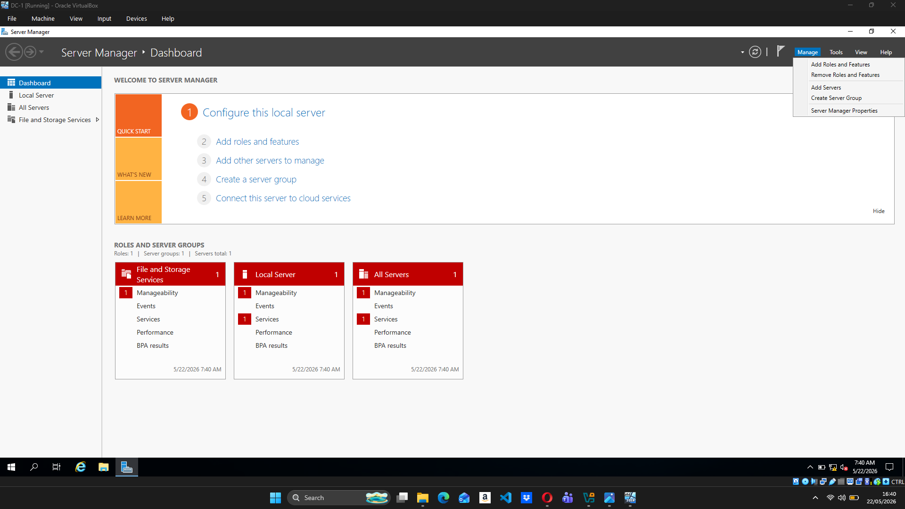
*Opening the Add Roles and Features wizard from Server Manager*

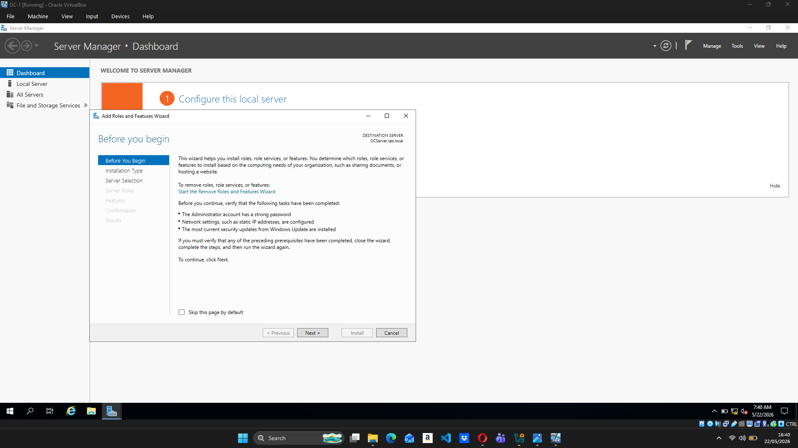
*Add Roles and Features Wizard — destination server: DCServer.lab.local*

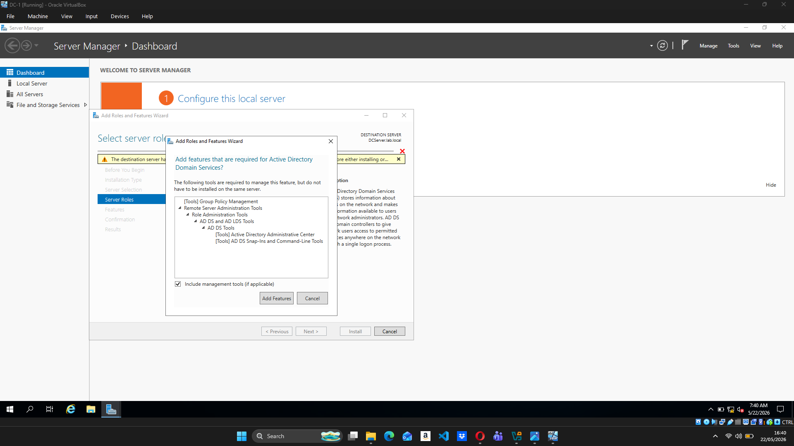
*Confirming required features for Active Directory Domain Services*

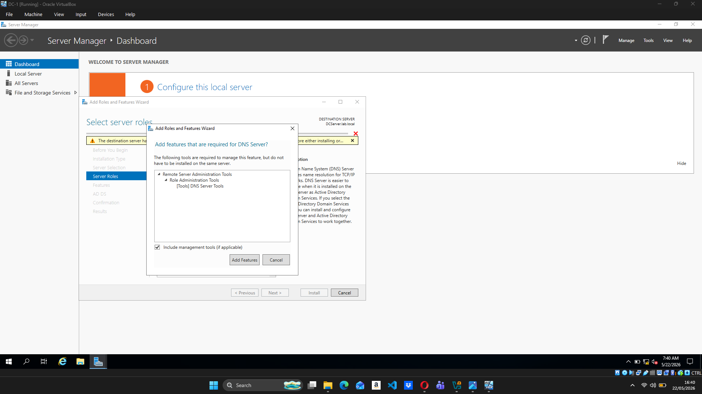
*Confirming required features for DNS Server*

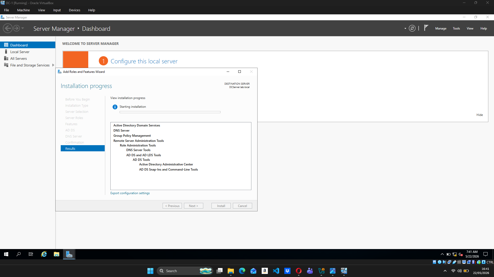
*AD DS, DNS Server, and Group Policy Management installing*

---

## Step 4 – Promote Server to Domain Controller

After installation, Server Manager displayed a post-deployment notification. The server was promoted to a Domain Controller by clicking **"Promote this server to a domain controller"**.

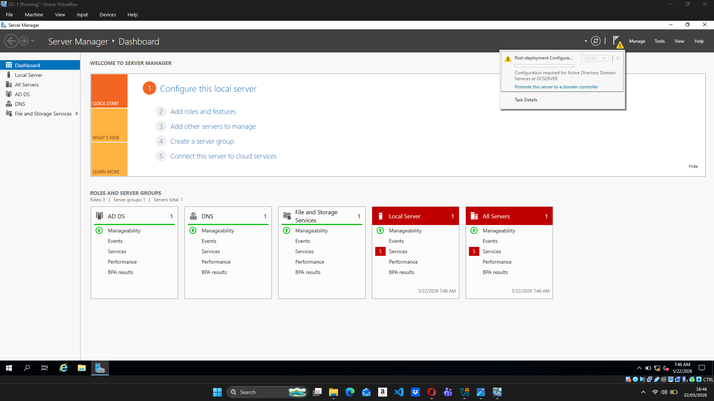
*Server Manager prompting to promote the server to a Domain Controller*

A **new forest** was created with the root domain name: `mydomain.com`

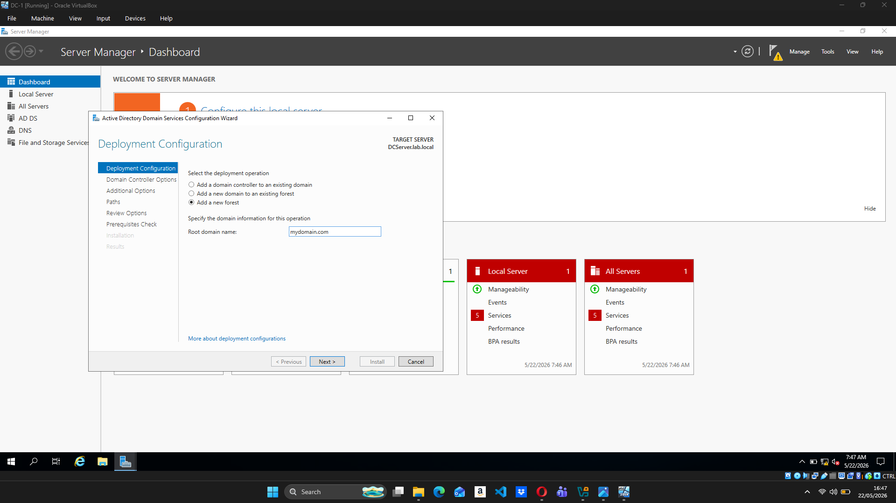
*AD DS Configuration Wizard — creating a new forest: mydomain.com*

Domain Controller options were configured with functional level **Windows Server 2016**, DNS and Global Catalog enabled, and a DSRM password set.

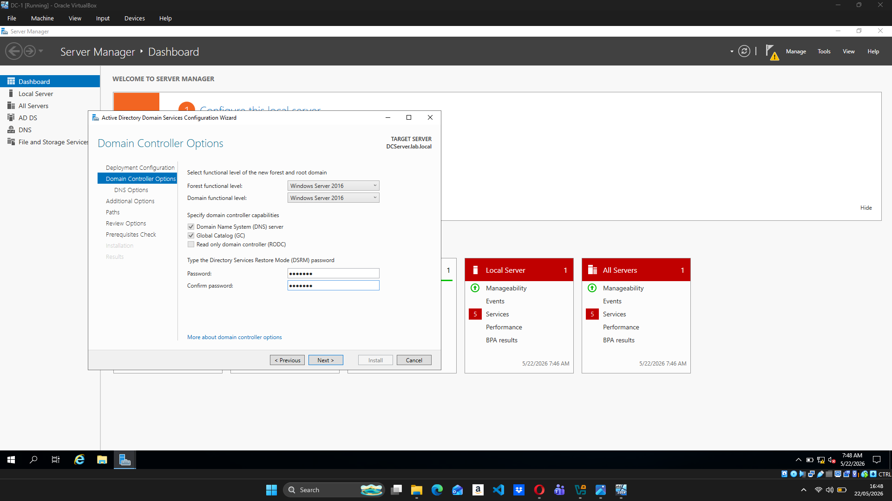
*Domain Controller Options — functional level, DNS, Global Catalog, DSRM password*

Prerequisites check passed successfully.

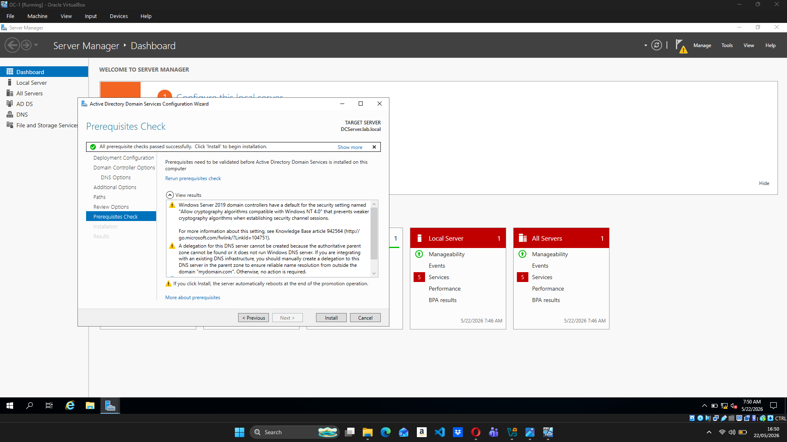
*All prerequisite checks passed — ready to install*

The server was successfully configured as a Domain Controller and automatically rebooted.

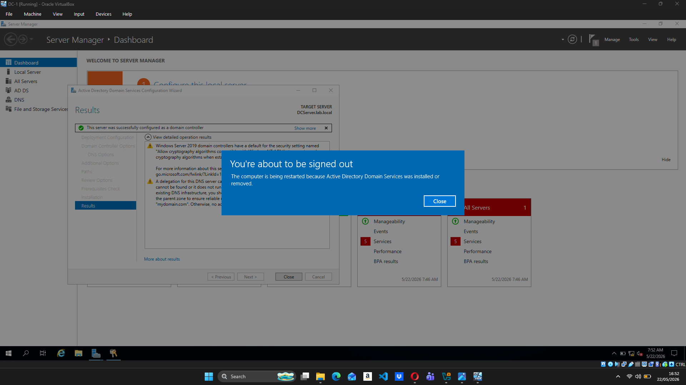
*Promotion complete — server restarting to apply changes*

After reboot, Server Manager confirmed AD DS and DNS roles were healthy.

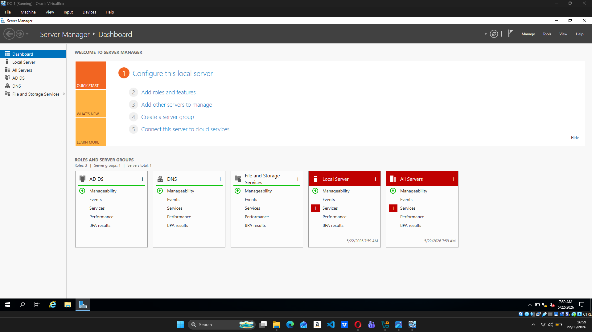
*Server Manager showing AD DS and DNS roles active after reboot*

---

## Step 5 – Configure Static IP Addresses

### DC-1 (Domain Controller)
A static IP was assigned so the server always has a fixed address on the network. The DNS was pointed to itself (`127.0.0.1`) since it hosts the DNS role.

| Setting | Value |
|---|---|
| IP Address | 192.168.1.1 |
| Subnet Mask | 255.255.255.0 |
| DNS Server | 127.0.0.1 |

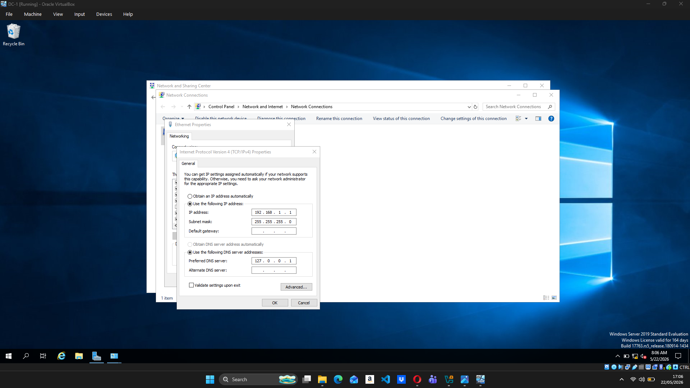
*DC-1 IPv4 settings — static IP 192.168.1.1, DNS pointing to itself*

### Client-1 (Windows 11)
The client was assigned a static IP and pointed to the DC's IP address as its DNS server. This is required so the client can locate the domain during the join process.

| Setting | Value |
|---|---|
| IP Address | 192.168.1.2 |
| Subnet Mask | 255.255.255.0 |
| DNS Server | 192.168.1.1 (DC-1) |

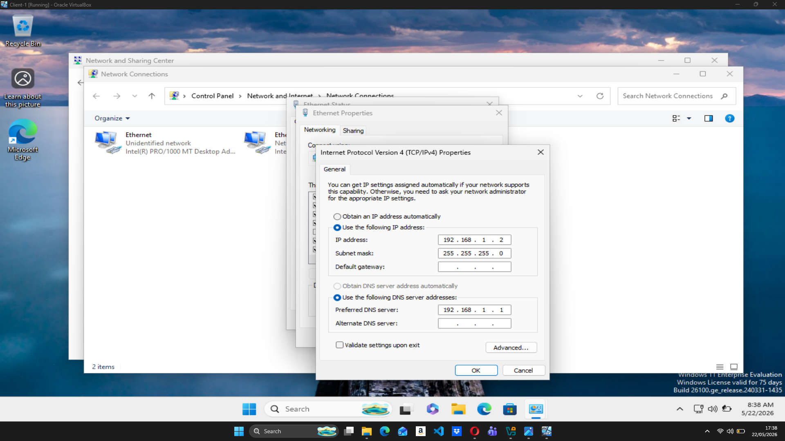
*Client-1 IPv4 settings — static IP 192.168.1.2, DNS pointing to DC at 192.168.1.1*

---

## Step 6 – Create Organizational Units and Users

In **Active Directory Users and Computers (ADUC)**, three Organizational Units were created under `mydomain.com` to reflect a real department structure:

- IT-Department
- HR-Department
- Finance-Department

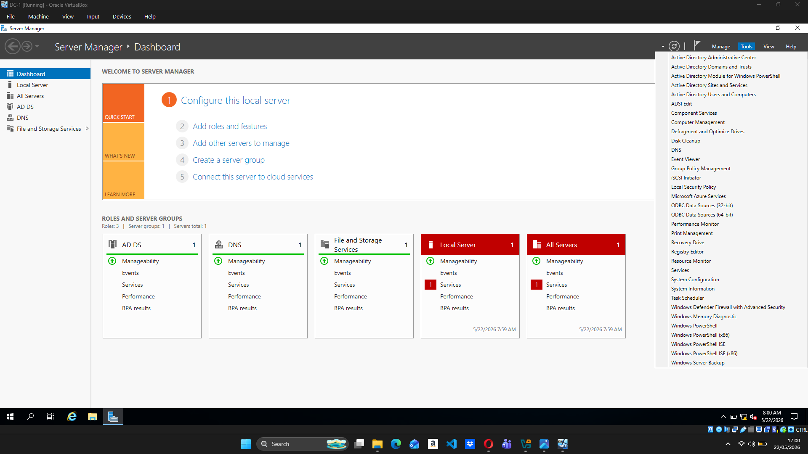
*Creating the HR-Department Organizational Unit inside mydomain.com*

*ADUC showing all three OUs: IT-Department, HR-Department, Finance-Department*

Inside the **IT-Department** OU, a security group and two user accounts were created:

- **Admim-Group** (Security Group)
- **John Smith** (User)
- **Solomon Yohanis** (User)

*IT-Department OU with security group and two domain user accounts*

---

## Step 7 – Join Client-1 to the Domain

From **Client-1**, the machine was joined to `mydomain.com` via **System Properties → Computer Name/Domain Changes**. The machine name was set to `DESKTOP01`.

After entering domain admin credentials, the join was successful and the machine was prompted to restart.

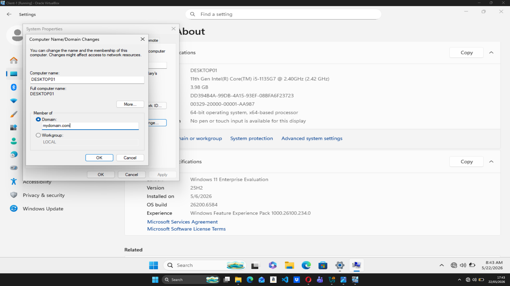
*Client-1 (DESKTOP01) successfully joined to mydomain.com — restart required*

---

## Step 8 – Log In as Domain User

After the restart, Client-1 was logged into using the domain user account **Solomon Yohanis**, which was created in the IT-Department OU on the Domain Controller.

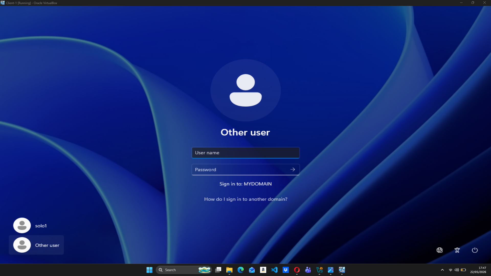
*Client-1 showing Welcome screen for domain user Solomon Yohanis*

---

## Step 9 – Verify Domain Join on DC

Back on DC-1, **Active Directory Users and Computers** confirmed that **DESKTOP01** appeared in the **Computers** container, verifying the client machine is a recognized member of the domain.

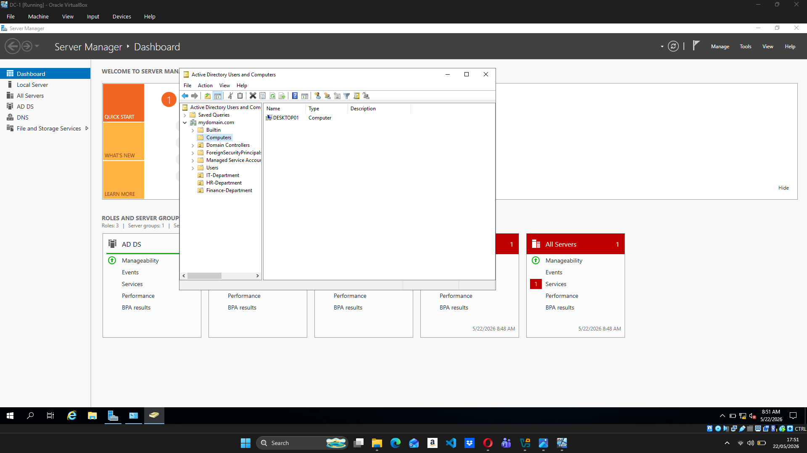
*DESKTOP01 visible in the Computers container of mydomain.com on the DC*

---

## Key Takeaways

- Configured an isolated internal network in VirtualBox to simulate an on-premises AD environment
- Installed and configured Active Directory Domain Services and DNS on Windows Server 2019
- Promoted a server to a Domain Controller and created a new forest from scratch
- Designed an OU structure to represent department-based organization
- Created domain users and security groups within OUs
- Joined a Windows 11 client to the domain and verified the connection from both sides
- Successfully authenticated to the domain using a non-admin domain user account

---

*Lab completed: May 2026 | Author: Solomon Yohanis*
